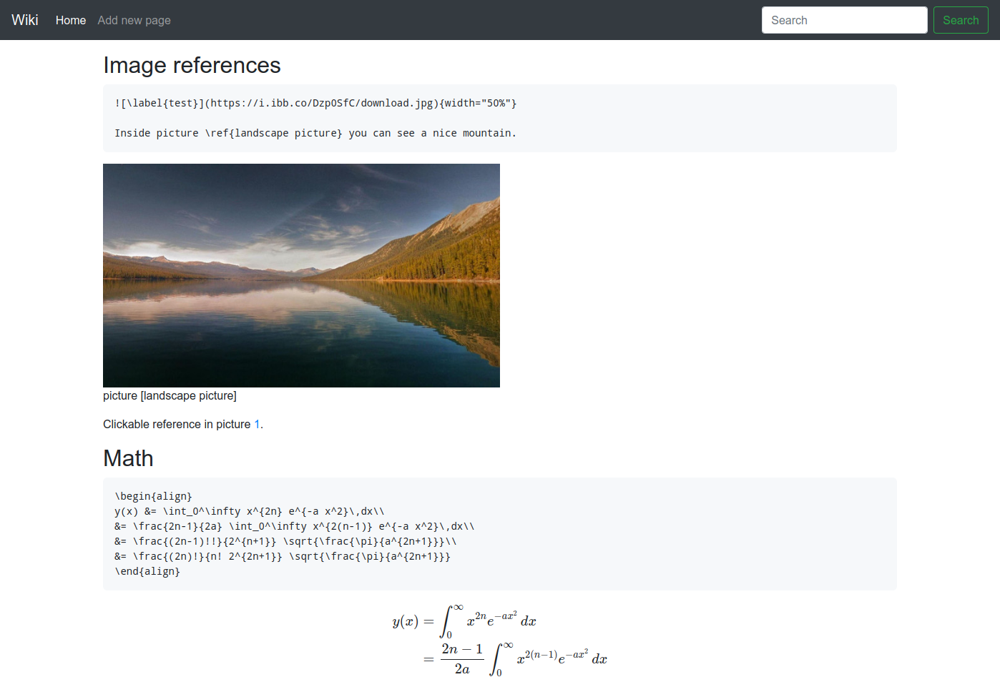

# wikmd


## Installation
! It's tested on windows and linux based systems.
! Only for personal use, can have security issues.

Clone te repository
```
git clone https://github.com/Linbreux/wikmd.git
```
cd in wikimd
```
cd wikimd
```

Create a virtual env and activate it(optional)
```
virtualenv venv
source venv/bin/activate
```
Install requirements
```
pip install -r requirements.txt
```
Run the wiki
```
export FLASK_APP=wiki.py
flask run --host=0.0.0.0
```
Maybe you need to install pandoc on your system before this works.
```
sudo apt-get update && sudo apt-get install pandoc
```

Now visit localhost:5000 and you will see the wiki. With the 0.0.0.0. option it will show up everywhere on the network.

## Docker install

### Build docker
```
docker build -t wiki-md:latest .
```
### Run Docker

You may need to create wiki/data in your homefolder or you can change it if you want another place.

```
sudo docker run -d -p 5000:5000 -v ~/wiki/data:/app/wiki wiki-md
```
If you would like to have the default files inside your instance, you should copy the wiki files to ~/wiki/data in this case.

```
cp wikmd/wiki/* ~/wiki/data/
```

## What is it?
It’s a file-based wiki that aims to simplicity. The documents are completely written in Markdown which is an easy markup language that you can learn in 60 sec.

## Why markdown?
If you compare markdown to a WYSIWYG editor it may look less easy to use but the opposite is true. When writing markdown you don’t get to see the result directly which is the only downside. Their are more pros: - Easy to process to other file formats - Scalable, it reformats for the perfect display width

## How does it work?
Instead of storing the data in a database I chose to have a file-based system. The advantage of this system is that every file is directly readable inside a terminal etc. Also when you have direct access to the system you can export the files to anything you like.

To view the documents in the browser, the document is converted to html.

### Image support


### Latex support

$$x_{1,2} = \frac{-b ± \sqrt{b^2 - 4 a c}}{2a}$$
## Homepage

The homepage is default the "homepage.md" file, this can't be changed. If this file doesn't exist create it in de wiki folder.

## Static images

If you have images that you don't want to be available on the internet, you can put them inside the folder **"static/images/"** for example **"testfile.png"**, now you can link to **"/static/images/testfile.png"**

## Latex

It's possible to use latex syntax inside your markdown because the markdown is first converted to latex and after that to html. This means you have a lot more flexibility.

### Change image size
```
{width="50%"}
```

### Image references
```
{width="50%"}

Inside picture \ref{landscape picture} you can see a nice mountain.

```

### Math
```
\begin{align}
y(x) &= \int_0^\infty x^{2n} e^{-a x^2}\,dx\\
&= \frac{2n-1}{2a} \int_0^\infty x^{2(n-1)} e^{-a x^2}\,dx\\
&= \frac{(2n-1)!!}{2^{n+1}} \sqrt{\frac{\pi}{a^{2n+1}}}\\
&= \frac{(2n)!}{n! 2^{2n+1}} \sqrt{\frac{\pi}{a^{2n+1}}}
\end{align}
```

```
You can also use $inline$ math to show $a=2$ and $b=8$
```

## Converting the files

Open the wiki folder of your instance.  

|- static  
|- templates  
|- **wiki** <--This folder  
|- wiki.py  

In this folder all the markdownfiles are listed. Editing the files will be visible in the web-version.  

|- homepage.md  
|- How to use the wiki.md  
|- Markdown cheatsheet.md  

The advantage is that u can use the commandline to process some data. For example using pandoc:
```
pandoc -f markdown -t latex homepage.md How\ to\ use\ the\ wiki.md -o file.pdf --pdf-engine=xelatex
```
This creates a nice pdf version of your article.  Its possible you have to create a yml header on top of your document to set the margins etc better
```
---
title: titlepage
author: your name
date: 05-11-2020
geometry: margin=2.5cm
header-includes: |
        \usepackage{caption}
        \usepackage{subcaption}
lof: true
---
```
For more information you have to read the pandoc documentation.
